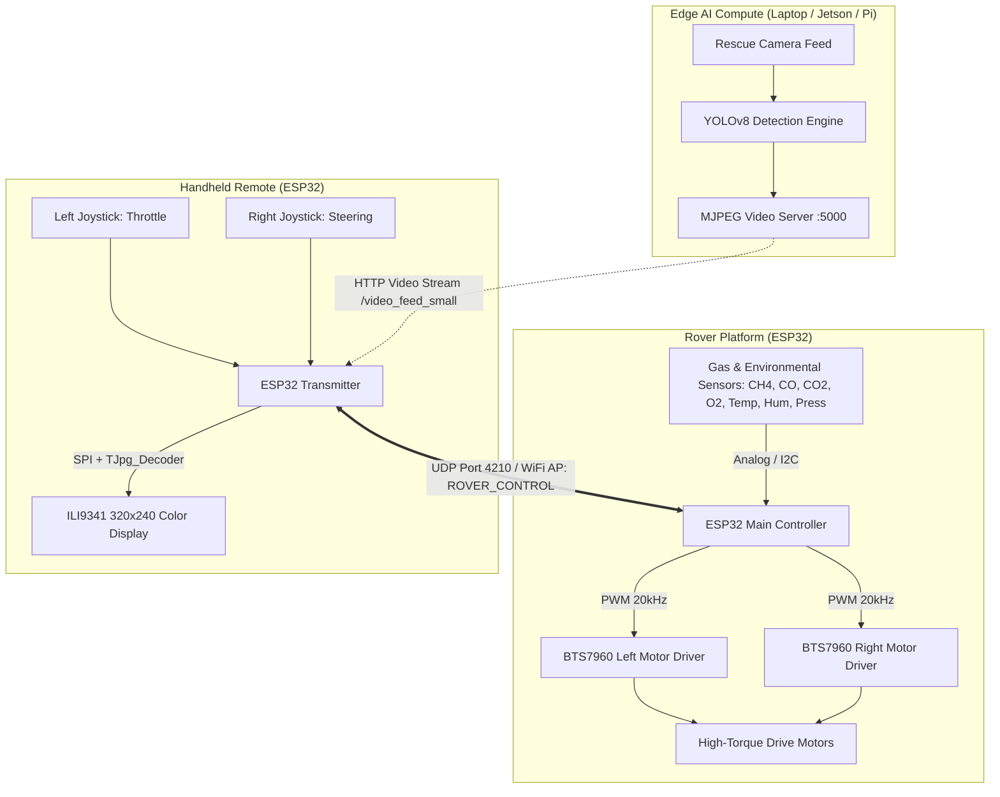

# 🚒 SETU: Autonomous & Teleoperated Search-and-Rescue Rover

**SETU** is an industrial-grade, edge-AI powered search-and-rescue rover platform engineered for hazardous environments, structural collapses, and subterranean mine rescue operations. 

The system combines **real-time edge AI victim detection** (YOLOv8) with **low-latency dual-ESP32 UDP teleoperation**, **hazardous gas atmospheric telemetry** ($CH_4, CO, CO_2, O_2$), and a **custom handheld transmitter with live color TFT video and telemetry display**.

---

## 📌 Table of Contents
1. [System Architecture](#-system-architecture)
2. [Hardware & Pinout Specifications](#-hardware--pinout-specifications)
3. [Communication Protocols](#-communication-protocols)
4. [Edge AI & Vision Subsystem](#-edge-ai--vision-subsystem)
5. [Dataset Pipeline](#-dataset-pipeline)
6. [Repository Structure](#-repository-structure)
7. [Installation & Setup](#-installation--setup)
8. [Usage Guide](#-usage-guide)
9. [Model Performance & Benchmarks](#-model-performance--benchmarks)
10. [Safety & Failsafe Mechanisms](#-safety--failsafe-mechanisms)

---

## 🏗️ System Architecture



---

## ⚡ Hardware & Pinout Specifications

### 1. Rover Board (ESP32)
- **Microcontroller:** ESP32-WROOM-32 (Dual Core 240MHz, 2.4GHz Wi-Fi)
- **Motor Drivers:** Dual BTS7960 43A High-Power H-Bridges
- **PWM Configuration:** 20 kHz frequency, 8-bit resolution (0–255, software-constrained to safe maximum `179`)

| Pin | Function | Peripheral Connection |
| :--- | :--- | :--- |
| **GPIO 25** | Left Forward (RPWM) | BTS7960 Left RPWM |
| **GPIO 33** | Left Reverse (LPWM) | BTS7960 Left LPWM |
| **GPIO 32** | Left Enable (REN) | BTS7960 Left R_EN |
| **GPIO 27** | Left Enable (LEN) | BTS7960 Left L_EN |
| **GPIO 26** | Right Forward (RPWM) | BTS7960 Right RPWM |
| **GPIO 14** | Right Reverse (LPWM) | BTS7960 Right LPWM |
| **GPIO 12** | Right Enable (REN) | BTS7960 Right R_EN |
| **GPIO 13** | Right Enable (LEN) | BTS7960 Right L_EN |

### 2. Handheld Controller (ESP32)
- **Display:** 2.8" ILI9341 SPI Color TFT LCD (320 × 240 resolution)
- **Rendering:** Hardware SPI + `TJpg_Decoder` + Adafruit GFX
- **Controls:** Dual 2-axis analog joysticks with center-deadzone calibration

| Pin | Function | Peripheral Connection |
| :--- | :--- | :--- |
| **GPIO 18** | SPI Clock (SCK) | ILI9341 TFT SCK |
| **GPIO 19** | SPI MISO | ILI9341 TFT MISO |
| **GPIO 23** | SPI MOSI | ILI9341 TFT MOSI |
| **GPIO 15** | Chip Select (CS) | ILI9341 TFT CS |
| **GPIO 2**  | Data/Command (DC) | ILI9341 TFT DC |
| **GPIO 4**  | Reset (RST) | ILI9341 TFT RESET |
| **GPIO 36** | Left Joystick X | Potentiometer X |
| **GPIO 39** | Left Joystick Y (Throttle) | Potentiometer Y |
| **GPIO 32** | Left Joystick Button | Tactile Switch |
| **GPIO 34** | Right Joystick X (Steering)| Potentiometer X |
| **GPIO 35** | Right Joystick Y | Potentiometer Y |
| **GPIO 33** | Right Joystick Button | Tactile Switch |
| **GPIO 27** | Capacitive / Touch Pin | Page Toggle / Mode Select |

---

## 📡 Communication Protocols

Teleoperation uses direct peer-to-peer UDP packets over a dedicated low-latency Wi-Fi Access Point (`SSID: ROVER_CONTROL`, `IP: 192.168.50.2`, `Port: 4210`).

### Packet Formats

| Command | Syntax | Description | Example |
| :--- | :--- | :--- | :--- |
| **Drive Motors** | `M,left,right` | Differential drive speed (-179 to +179) | `M,120,120` (Forward), `M,-90,90` (Spin turn) |
| **Emergency Stop**| `S` | Instant dynamic brake on all motors | `S` |
| **Heartbeat** | `H,local_ip` | Keep-alive handshake emitted every 1s | `H,192.168.50.2` |
| **Telemetry** | `T,CH4,CO,CO2,O2,TEMP,HUM,PRESS` | Multi-sensor environmental telemetry packet | `T,1.24,8.6,820,20.7,28.6,67.4,1008.4` |

#### Telemetry Sensor Units:
- **$CH_4$ (Methane):** `%LEL` (Lower Explosive Limit)
- **$CO$ (Carbon Monoxide):** `ppm`
- **$CO_2$ (Carbon Dioxide):** `ppm`
- **$O_2$ (Oxygen):** `%VOL`
- **Temperature:** `°C`
- **Humidity:** `%RH`
- **Pressure:** `hPa`

---

## 🧠 Edge AI & Vision Subsystem

The vision pipeline is tailored for low-light, cluttered, and smoke-affected environments to detect human victims in real time without false triggers on hanging clothes, coats, or debris.

### Model Architecture
- **Primary Model:** Fine-tuned **YOLOv8** (Nano & Small variants)
- **Target Class:** `0: person`
- **Input Dimensions:** `640 x 640 x 3`
- **Optimization:** Automatic Mixed Precision (AMP), TorchScript JIT export for low-latency embedded deployment

### Model Directory Structure
```text
models/
├── best.pt                       # Top-performing checkpoint weights
├── setu_person_detector.pt       # Primary deployed weights copy
├── checkpoints/
│   ├── best.pt                   # Best validation epoch snapshot
│   └── last.pt                   # Final training epoch state
├── exported/
│   └── setu_person_detector.torchscript # Standalone TorchScript model for C++ / Edge runtimes
├── pretrained/
│   ├── yolov8n.pt                # YOLOv8 Nano base backbone (3.15M params)
│   └── yolov8s.pt                # YOLOv8 Small base backbone (11.14M params)
└── metrics.json                  # Quantitative evaluation results on test set
```

---

## 📊 Dataset Pipeline

The dataset consists of **5,000 verified images** indexed from the COCO Person dataset, split with zero session contamination:

| Split | Image Count | Label Count | Role |
| :--- | :--- | :--- | :--- |
| **Train** | 3,500 | 3,500 | Training set with YOLO bounding box annotations |
| **Val** | 500 | 500 | Holdout validation set for model checkpointing |
| **Test** | 1,000 | 1,000 | Unseen benchmark set for final performance reporting |

- Dataset Configuration: [datasets/data.yaml](file:///c:/Users/Abdul%20Arham%20Malik/OneDrive/Desktop/SETU/datasets/data.yaml)
- Full Manifest: [datasets/manifests/manifest.csv](file:///c:/Users/Abdul%20Arham%20Malik/OneDrive/Desktop/SETU/datasets/manifests/manifest.csv)

---

## 📁 Repository Structure

```text
SETU/
├── datasets/
│   ├── data.yaml            # YOLO dataset configuration
│   ├── manifests/           # Master CSV manifests
│   ├── raw/                 # Raw dataset downloads
│   ├── train/               # Training images and YOLO labels
│   ├── val/                 # Validation images and labels
│   └── test/                # Test images and labels
├── models/                  # Checkpoints, exported models, and metrics
├── edge-ai/
│   └── detect.py            # Live on-screen camera inference with HUD
├── scripts/
│   ├── train.py             # Model training and export pipeline
│   ├── split_dataset.py     # Deterministic dataset splitting
│   ├── build_manifest.py    # CSV manifest builder
│   ├── fetch_coco_person.py # FiftyOne automated COCO fetcher
│   └── add_background_samples.py # Negative sample injection utility
├── firmware/
│   ├── rover.ino            # Rover firmware (ESP32, BTS7960, UDP)
│   └── controller.ino       # Remote transmitter firmware (ESP32, TFT, Joysticks)
├── hardware/                # Schematics, PCB layouts, and BOM
├── ARCHITECTURE.md          # System architecture design notes
├── VALIDATION.md            # Benchmark validation report
└── requirements.txt         # Python project dependencies
```

---

## ⚙️ Installation & Setup

### 1. Python Environment Setup
```powershell
# Navigate to project root
cd "C:\Users\Abdul Arham Malik\OneDrive\Desktop\SETU"

# Activate the local virtual environment
.\venv\Scripts\Activate.ps1

# Install requirements
pip install -r requirements.txt
```

### 2. ESP32 Firmware Installation
1. Open **Arduino IDE**.
2. Install **ESP32 Board Package** by Espressif (`Tools > Board > Boards Manager`).
3. Install required libraries:
   - `Adafruit GFX Library`
   - `Adafruit ILI9341`
   - `TJpg_Decoder`
4. Connect the **Rover ESP32**, open `firmware/rover.ino`, select the COM port, and upload.
5. Connect the **Controller ESP32**, open `firmware/controller.ino`, select the COM port, and upload.

---

## 🚀 Usage Guide

### 1. Train the AI Model
To train the detection model on your GPU:

```powershell
.\venv\Scripts\python.exe scripts/train.py --weights models/pretrained/yolov8s.pt --epochs 15 --batch 8 --workers 0 --device 0
```

#### Training Arguments:
- `--weights`: Path to initial weights (`yolov8n.pt` or `yolov8s.pt`)
- `--epochs`: Number of iterations (recommended: 15–25)
- `--batch`: Batch size (recommended: 8 for 4GB VRAM, 16 for 8GB+ VRAM)
- `--workers`: Number of dataloader workers (`0` recommended on Windows for stable memory paging)
- `--device`: CUDA device index (`0` for GPU, `cpu` for CPU)

All artifacts are automatically saved into the `models/` directory upon completion.

### 2. Live On-Screen Vision HUD
Launch the live camera inference window with search-and-rescue HUD:

```powershell
# Webcam live detection
.\venv\Scripts\python.exe edge-ai/detect.py --model models/best.pt --source 0 --conf 0.55

# Video file inference
.\venv\Scripts\python.exe edge-ai/detect.py --model models/best.pt --source video.mp4 --conf 0.55
```

- **Bounding Boxes:** Highlights detected victims with exact confidence percentages.
- **Top HUD Banner:** Real-time alert status (`ALERT: PERSON DETECTED` vs `SEARCHING`).
- **Performance Monitor:** Live FPS counter and active confidence threshold.
- **Exit:** Press `'q'` or `ESC` in the display window.

---

## 📈 Model Performance & Benchmarks

The upgraded **YOLOv8s** production model was evaluated against **1,000 unseen holdout images** containing **4,182 ground truth person instances**:

| Metric | YOLOv8n (Baseline) | YOLOv8s (Upgraded) | Improvement | Impact on Mission |
| :--- | :--- | :--- | :--- | :--- |
| **Precision** | 72.37% | **74.92%** | **+2.55%** | Suppresses false alarms on hanging clothes/furniture |
| **Recall** | 54.04% | **57.39%** | **+3.35%** | Enhanced victim detection across varied poses |
| **mAP@50** | 63.88% | **67.03%** | **+3.15%** | Higher certainty on standard bounding box overlap |
| **mAP@50-95** | 39.90% | **42.79%** | **+2.89%** | Superior localization accuracy under heavy debris |
| **Inference Latency** | 3.39 ms | **7.73 ms / frame** | — | **~130 FPS real-time throughput** on RTX 3050 GPU |
| **Pre-process Latency** | 0.62 ms | **0.30 ms / frame** | Fast | Hardware-accelerated letterboxing |
| **Post-process Latency**| 0.74 ms | **0.90 ms / frame** | Fast | Rapid Non-Maximum Suppression (NMS) |

---

## 🛡️ Safety & Failsafe Mechanisms

1. **Watchdog Failsafe (`MOTOR_TIMEOUT = 350 ms`):**
   If the rover loses Wi-Fi contact or does not receive a valid motor command packet within **350 ms**, the firmware immediately disables the H-bridge enable lines (`REN=LOW, LEN=LOW`) and cuts PWM drive to prevent runaway rover accidents.
2. **Speed Limiting (`MAX_MOTOR_SPEED = 179`):**
   Motors are software-constrained to a maximum PWM duty cycle of **179** (70% of 255) to protect gearbox integrity and prevent high-speed rollover over rubble.
3. **Deadzone Filtering (`JOY_DEADZONE = 350`):**
   Joystick readings near center are filtered to prevent motor jitter caused by mechanical potentiometer drift.
4. **Heartbeat Diagnostics:**
   Both rover and controller exchange heartbeat packets every second; the controller TFT displays live connection status and triggers an audible/visual alert if communication drops.
